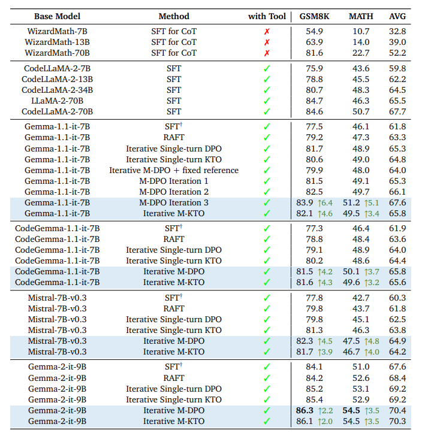

<h1 align="center">
<br>
Building Math Agents with Multi-Turn Iterative Preference Learning
</h1>

<p align="center">
TL;DL: this is the repo for "<a href="https://arxiv.org/abs/2309.17452" target="_blank">Building Math Agents with Multi-Turn Iterative Preference Learning</a>"
</p>

We consider the math problem solving with python interpreter, which means that the model can write a python code and ask the external environmnet to execute and receive the excutaion result, before the LLM makes its next decision.

<p align="center">
    
        <br>
    <em>Figure 1: Main evaluation results on the MATH and GSK8K datasets.</em>
</p>

## Installation instructions

The main pipeline is divided into three steps:

- Supervised Fine-tuning (SFT);
- Data generation and annotation;
- Multi-turn DPO/KTO Training.

It is recommended to have three separate environments for **sft**, **inference**, and **dpo_train**. Please refer to the corresponding part of this project for the detailed installation instruction. 


## Citation

If you find the content of this repo useful, please consider cite it as follows:

```bibtex
@article{xiong2024building,
  title={Building Math Agents with Multi-Turn Iterative Preference Learning},
  author={Xiong, Wei and Shi, Chengshuai and Shen, Jiaming and Rosenberg, Aviv and Qin, Zhen and Calandriello, Daniele and Khalman, Misha and Joshi, Rishabh and Piot, Bilal and Saleh, Mohammad and others},
  journal={arXiv preprint arXiv:2409.02392},
  year={2024}
}
```
